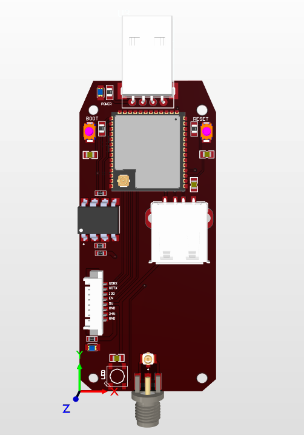
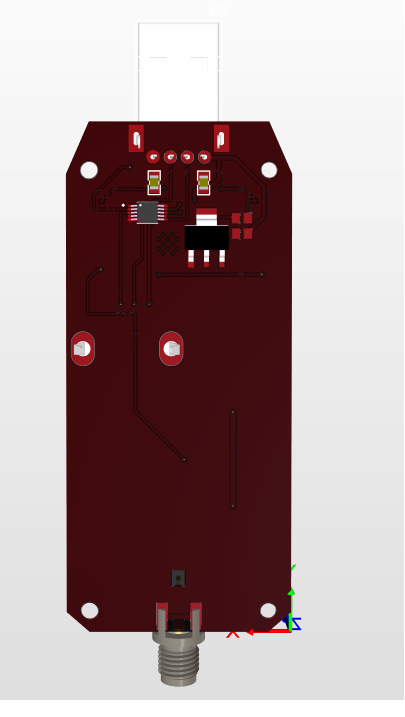
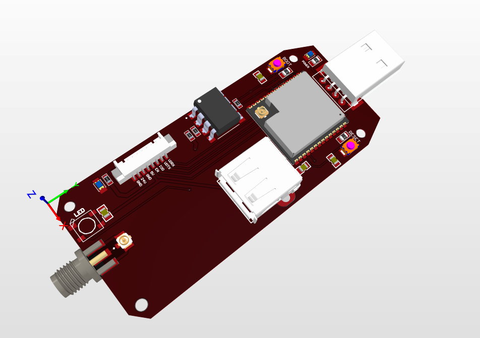

# USB Data Logger

👋 Welcome to the **USB Data Logger** project! This board is designed to facilitate data logging via USB connections, making it a versatile tool for capturing and storing data from various sources. Built with **ESP32-S3** and developed in **Altium Designer 21**, this USB Data Logger supports both USB host and device communication modes, enabling flexible and powerful data logging solutions.

## 📌 Project Overview

The USB Data Logger is equipped with an ESP32-S3 microcontroller, allowing it to log data through USB with ease. The design supports USB host and device protocols, making it adaptable for different logging scenarios. This logger is ideal for applications that require monitoring, recording, and analyzing data over extended periods, such as environmental monitoring, industrial diagnostics, and more.

### 🔧 Key Features
- **Microcontroller**: ESP32-S3, featuring USB OTG (On-The-Go) capabilities for both host and device modes.
- **USB Protocol Support**: Compatible with USB 2.0, allowing high-speed data transfer.
- **Data Logging**: Capable of storing large datasets from USB-connected devices for long-term analysis.
- **Expandable Storage**: Supports external storage (e.g., USB Storage, microSD) for extended data logging capacity.
- **Low Power Mode**: Efficient power consumption for prolonged usage in the field.

### 📋 Specifications
- **Board Name**: USB Data Logger
- **Microcontroller**: ESP32-S3 with USB OTG support
- **USB Compatibility**: USB 2.0 Host and Device modes
- **Storage Options**: Onboard flash, expandable with microSD
- **Power Supply**: USB-powered with low power options for portable applications

## 📷 Board Images

| View        | Image                             |
|-------------|-----------------------------------|
| **Top View**    |       |
| **Bottom View** |  |
| **Front Left View** |  |
## 🚀 Getting Started
To start using the **USB Data Logger**:
1. Connect the board to a USB power source and set up the desired USB mode (host or device).
2. Program the ESP32-S3 with firmware tailored for your data logging requirements (e.g., logging environmental data, diagnostics).
3. Attach a compatible USB device or sensor for data input in host mode, or connect it to a host for data retrieval in device mode.
4. Configure storage options, either using onboard flash or an external microSD card, to store the logged data.
5. Begin logging data, and access stored data periodically for analysis.

## 🛠 Usage Examples
1. **Environmental Data Logging**: Capture data from USB sensors for temperature, humidity, or other environmental variables and store it on a microSD card.
2. **Device Diagnostics**: Use the USB Data Logger in host mode to log diagnostic data from USB-connected devices for troubleshooting or maintenance purposes.
3. **Portable Data Collection**: Operate in low power mode for portable applications where continuous data logging is needed in the field.

---

🔗 **See Also**  
- [ESP32-S3 Documentation](https://www.espressif.com/en/products/socs/esp32-s3)
- [USB 2.0 Protocol Overview](https://www.usb.org/document-library/usb-20-specification)
- [Altium Designer 21 Documentation](https://www.altium.com/documentation/altium-designer/)
## Contact

For any questions or additional support, feel free to reach out:

- **Name**: Mai Xuan Canh
- **University**: Ho Chi Minh City University of Technology (HCMUT)
- **Major**: Control and Automation Engineering
- **LinkedIn**: [Canh Mai's LinkedIn](https://www.linkedin.com/in/maixuancanh2003/)
- **Email**: canhmai.work@gmail.com

---